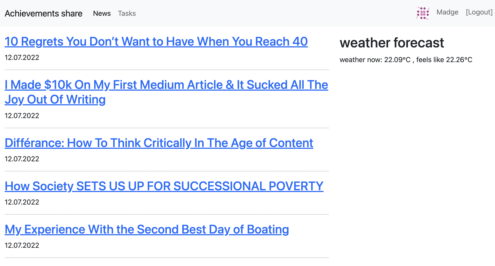
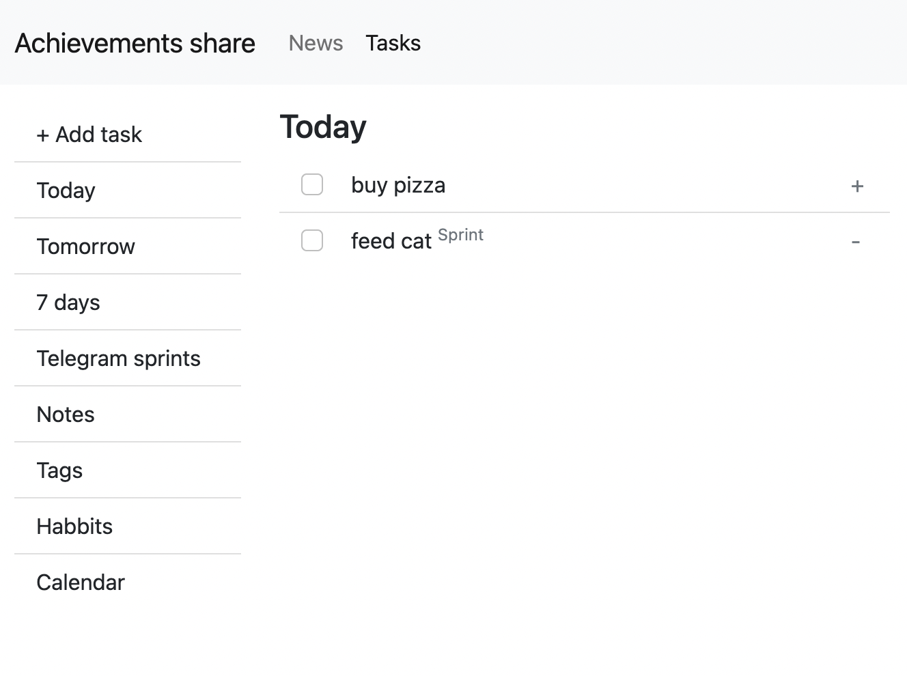
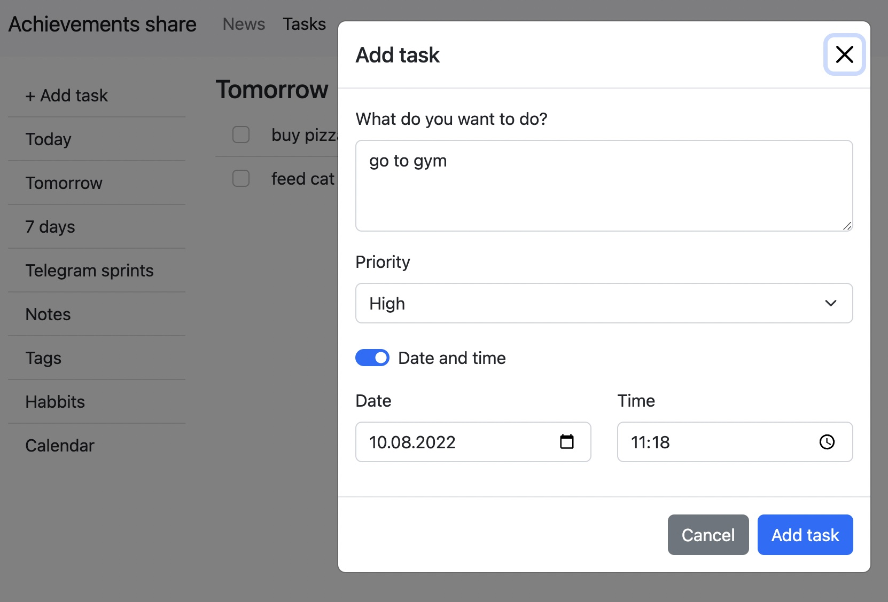
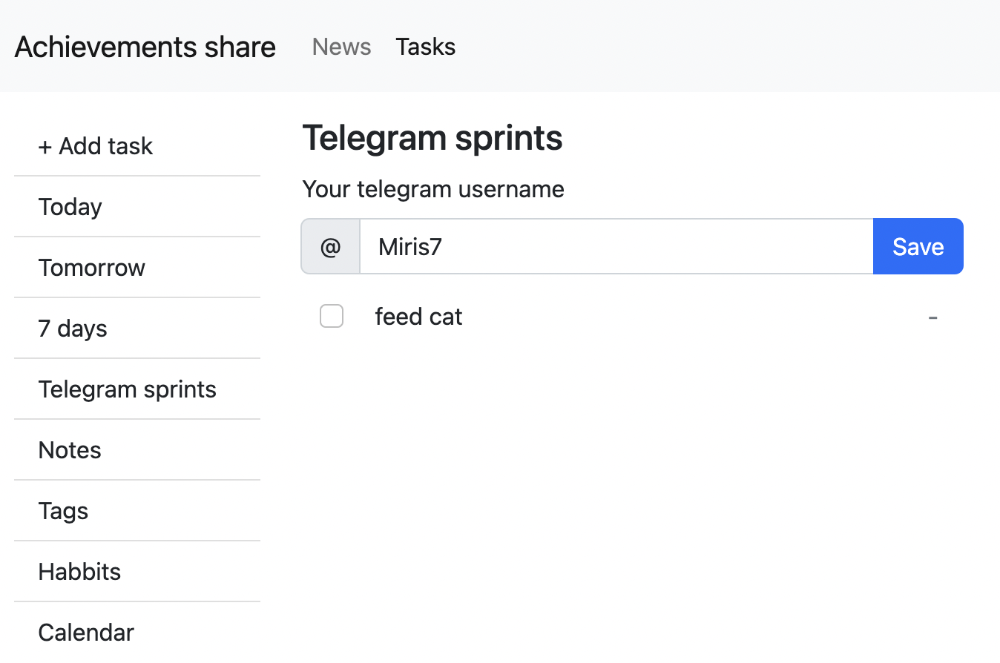

# Achievemate
Achievemate is a web application for creating and tracking goals/forming habits and sharing them to keep you motivated and get feedback.
You can write down a goal for the day, plan, month.
You can send your goals throw telegram to special telegram channel: https://t.me/achievemate.
You can use Pomodoro-bot in telegram chanel: https://t.me/pomodor0bot/.
folder: 'pomodorobot'

##Examples

##Roadmap
I plan to add to the project:
notes,
analytics for a week/month/six months,
show goals on a shared page for other users,
comments on goals,
host a project.

## Contributing
Pull requests are welcome. For major changes, please open an issue first to discuss what you would like to change.
